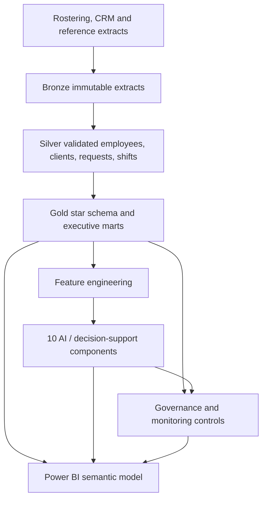
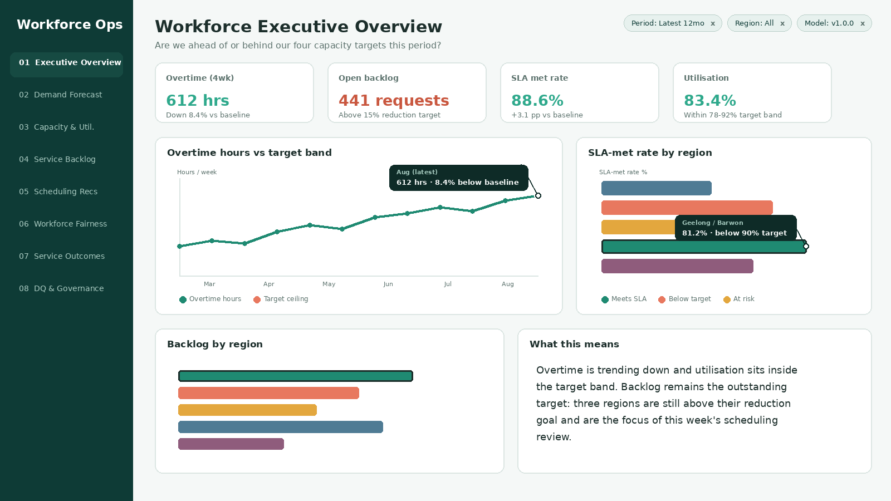

# Workforce Capacity and Service-Demand Optimisation

An end-to-end analytics and AI platform for a multi-region field and community services
organisation. It turns rostering, client-request and service-delivery data into forecasts,
predictions and scheduling recommendations that align workforce capacity to changing service
demand -- while keeping employee workloads fair, service levels intact, and every recommendation
subject to human review.

## Business case

Scheduling today is manual and reactive, producing overtime, backlog, uneven workloads and
inconsistent service levels. The target operating outcomes: 10-20% less overtime, 15% less
backlog, 10% better service-level performance, 20% less manual scheduling effort, and more evenly
balanced workloads -- each benchmarked against a baseline computed from the data itself. Full
framing in [`docs/business_case.md`](docs/business_case.md).

## Architecture



Local execution uses DuckDB; the bronze/silver/gold boundaries, dbt project and orchestration
stages are designed to map directly onto Microsoft Fabric Lakehouse, Warehouse, Data Factory and
Power BI. See [`docs/architecture.md`](docs/architecture.md) for the full design and the
production-scaling note.

## Quick start

```bash
python -m venv .venv
source .venv/bin/activate
pip install -r requirements.txt
python -m python.run_pipeline --stage all
pytest
```

This generates a realistic year of synthetic workforce and service-demand data, builds the
medallion warehouse, engineers features, trains all 6 models and runs the 4 decision-support
components, executes every governance/monitoring control, and exports the Power BI sample
dataset -- end to end in under 20 seconds. No real client or employee data is included anywhere
in this repository. See `configs/data_generation.yml` for the dev-mode row counts and
`docs/architecture.md` for how to reason about production scale.

## Repository map

| Area | Purpose |
|---|---|
| `python/ingestion/` | Synthetic source-data generator |
| `python/transformation/`, `sql/`, `dbt/` | Bronze/silver/gold medallion build and tests |
| `python/features/` | Model-ready feature tables, protected-attribute exclusion |
| `python/models/` | 6 trained models + 4 decision-support components |
| `python/monitoring/` | Data-quality and model/drift monitoring |
| `python/governance/` | Fairness checks, access control, override audit trail |
| `governance/` | Data catalogue, lineage, privacy, access, risk, model card |
| `powerbi/` | Semantic model, DAX, theme, 8-page dashboard mockups |
| `docs/` | Business case, architecture, data dictionary, metrics, presentations |
| `tests/` | Automated tests across data, warehouse, models and governance |

## AI and decision-support layer

Six trained models, each with a transparent baseline and a challenger, evaluated with real
computed metrics on every run: **demand forecasting** (HistGradientBoostingRegressor vs.
seasonal-naive), **request-complexity prediction**, **cancellation/no-show prediction**,
**service-level breach prediction**, **workload estimation** and **capacity-gap prediction**. Four
deterministic decision-support components complete the loop: **skill matching**, a constrained
greedy **scheduling optimiser**, **shift recommendations** and a what-if **scenario planner**. Full
results, thresholds and known limitations are in
[`governance/model_card.md`](governance/model_card.md) -- reported honestly, including the models
that are flagged "warning" rather than inflated to look uniformly green.

## Governance and responsible AI

Every pipeline run executes: 7 automated data-quality rules, a fairness check across governed
employee cohorts (gender, age band) with small-cohort suppression, a role-based access-control
test, PSI-based model drift monitoring, and an append-only schedule-override audit log. Protected
attributes are structurally excluded from every model feature table -- see
[`governance/privacy_assessment.md`](governance/privacy_assessment.md) and
[`governance/model_card.md`](governance/model_card.md).

## Power BI report

Eight pages: Workforce Executive Overview, Demand Forecast, Capacity and Utilisation, Service
Backlog, Scheduling Recommendations, Workforce Fairness, Service Outcomes, and Data Quality and
Governance. The image below is a reproducible, script-rendered design preview of the executive
page, demonstrating the KPI layout, chart legends, axis labels, hover tooltips, cross-filter
highlighting, filter chips and narrative structure used consistently across all 8 pages.



View all 8 pages in [`powerbi/Screenshots`](powerbi/Screenshots), annotated layouts in
[`powerbi/Mockups`](powerbi/Mockups), the [navigation design](powerbi/Navigation.md), the
[end-user walkthrough](powerbi/End_User_Walkthrough.md), and the
[reproducible build package](powerbi/Templates/README.md).

## Documentation

[Business case](docs/business_case.md) · [Architecture](docs/architecture.md) ·
[Data dictionary](docs/data_dictionary.md) · [Metrics catalogue](docs/metrics_catalogue.md) ·
[Operating model](docs/operating_model.md) · [Model card](governance/model_card.md) ·
[Risk register](governance/risk_register.md) ·
[Executive presentation](docs/executive_presentation.md) ·
[Five-minute walkthrough](docs/five_minute_walkthrough.md) ·
[Technical interview guide](docs/technical_interview_guide.md) ·
[Business interview guide](docs/business_interview_guide.md) ·
[Portfolio summary](docs/portfolio_summary.md)
