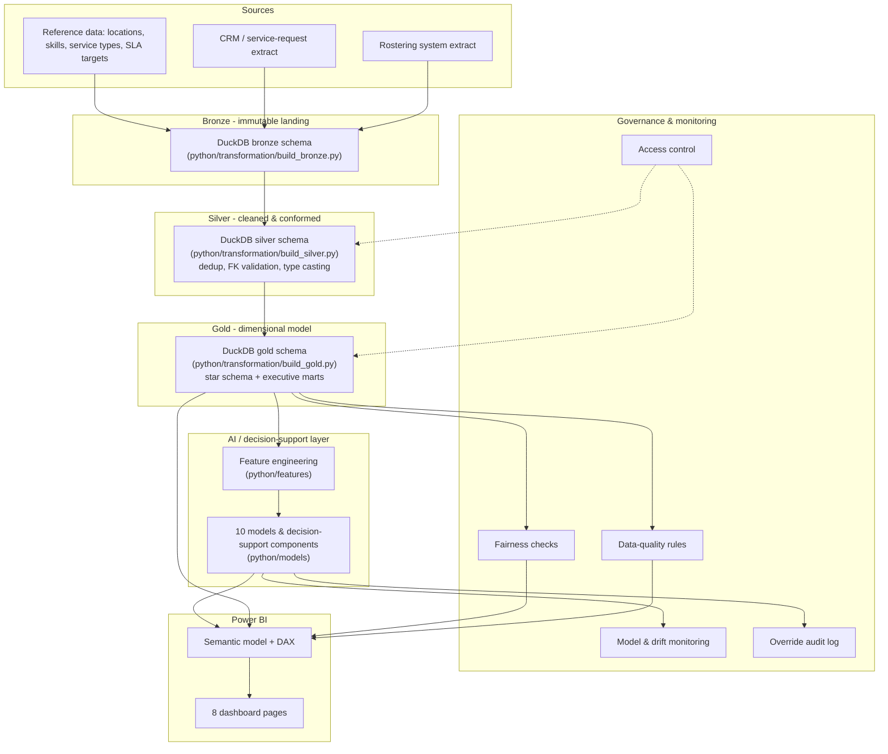

# Architecture

## Overview

The platform follows a medallion architecture, implemented locally with DuckDB and designed to
map directly onto Microsoft Fabric for a production deployment: Lakehouse for bronze/silver,
Warehouse (or Lakehouse SQL endpoint) for gold, Data Factory for orchestration, and Power BI for
the semantic layer and reporting.

## Why DuckDB locally, Fabric in production

DuckDB gives a single embedded file (`artifacts/warehouse.duckdb`) that behaves like a real
analytical SQL engine -- schemas, joins, window functions, `read_csv_auto` ingestion -- without
requiring a cluster. The bronze/silver/gold SQL in `sql/` is written in portable ANSI-adjacent
SQL so the same statements would need only connection-string and a handful of dialect changes
(mainly `read_csv_auto` → a Fabric Lakehouse shortcut/table reference) to run against a Fabric
Warehouse. The `dbt/` project mirrors the same staging → intermediate → marts structure using the
`duckdb` adapter locally, and would swap to a Fabric-compatible adapter in production.

## Component responsibilities

| Layer | Responsibility | Key modules |
|---|---|---|
| Ingestion | Generate/land synthetic source extracts | `python/ingestion/generate_synthetic_data.py` |
| Transformation | Bronze → silver → gold medallion build | `python/transformation/*.py`, `sql/*`, `dbt/models/*` |
| Features | Model-ready feature tables, protected-attribute exclusion | `python/features/feature_engineering.py` |
| Models | Forecasting, classification, optimisation, scenario planning | `python/models/*.py` |
| Monitoring | Data quality, model performance, drift | `python/monitoring/*.py` |
| Governance | Fairness, access control, audit trail | `python/governance/*.py` |
| Presentation | Power BI semantic model, DAX, dashboard mockups | `powerbi/*` |

## Scaling to production

The dev-mode row counts in `configs/data_generation.yml` (150 employees, 520 clients, ~17
requests/day) are sized to keep the repository light and every script fast to run end-to-end.
`configs/data_generation.yml` documents the `production_scale_multiplier` block used to reason
about a realistic production footprint (~1,800 employees, ~10,400 clients, ~255 requests/day
across a state-wide service footprint) without changing any code -- only the generator
parameters and, in production, the compute tier of the underlying Fabric capacity. The
transformation and modelling code is agnostic to row count; DuckDB comfortably handles the
production-scale row counts on a single node, and Fabric Warehouse/Spark would be used beyond
that.

## Dev mode vs. full pipeline

Set `WFCSO_DEV_MODE=true` (default) to use the compact dataset sized for a fast, complete local
run (`python -m python.run_pipeline --stage all` completes in well under a minute of actual CPU
time on an unloaded machine). Setting `WFCSO_DEV_MODE=false` is a placeholder switch for a future
generator revision that would read the `production_scale_multiplier` block and produce the full
production-scale synthetic dataset; today the generator always uses the `dev_mode` block, which
is the intended behaviour for a portfolio-scale repository.
