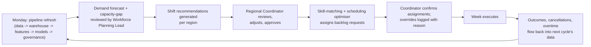

# Target-State Operating Model

## Weekly planning cycle

## Roles and responsibilities

| Role | Weekly activity |
|---|---|
| Data Platform Engineer | Runs/monitors the pipeline; investigates data-quality or pipeline failures |
| Workforce Planning Lead | Reviews demand forecast and capacity-gap prediction; sets the demand-growth assumption used in scenario planning |
| Regional Coordinator | Reviews shift recommendations and skill-matched candidates for their region; approves or overrides with a documented reason |
| People & Culture Lead | Reviews the Workforce Fairness dashboard monthly; investigates any cohort flagged by `fairness_checks.py` |
| Model Risk Reviewer | Reviews the Data Quality and Governance dashboard; signs off model status changes |
| Service Delivery Executive | Reviews the Executive Overview dashboard; owns the overall KPI targets in `docs/business_case.md` |

## Human-in-the-loop control points

The platform is decision-support, not autonomous scheduling. Every model output that changes a
person's roster or a client's appointment passes through a human approval point:

1. **Shift recommendations** are a proposed change in shift count per region -- a coordinator
   decides whether and how to action them.
2. **Skill-matching** produces a ranked candidate list; the coordinator makes the final selection.
3. **Scheduling optimiser assignments** are a proposed roster for open backlog requests; any
   change from the proposal is captured as an override with a reason
   (`python/governance/audit_log.py`).
4. **SLA-breach and cancellation predictions** surface a risk flag; they do not automatically
   cancel, reprioritise, or contact anyone.

## Escalation and exception handling

- A data-quality rule failing severity `high` (see `governance/data_quality_rules.yml`) blocks the
  governance dashboard from showing "Healthy" status and is escalated to the Data Platform
  Engineer same-day.
- A fairness check breach (`python/governance/fairness_checks.py`) is escalated to People &
  Culture within 5 business days per the risk register.
- A model threshold breach (see `configs/monitoring.yml`) triggers the retraining review process
  documented in `governance/model_card.md`.

## Mobile / on-the-go note

Regional coordinators frequently work from a vehicle or a client site. The Power BI report is
designed to degrade gracefully to a single-column mobile layout (see
`powerbi/dashboard_specification.md` "Mobile layout") for the Scheduling Recommendations and
Service Backlog pages, which are the two pages a coordinator is most likely to check outside the
office.
