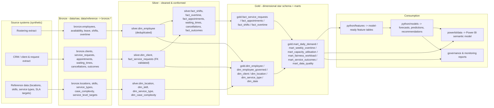

# Data Lineage

## End-to-end flow



## Table-level lineage

| Gold table | Built from | Build script |
|---|---|---|
| `gold.dim_employee` | `silver.dim_employee` | `sql/gold/02_star_schema.sql` |
| `gold.dim_employee_governed` | `silver.dim_employee` (protected attributes only) | `sql/gold/02_star_schema.sql` |
| `gold.dim_client` | `silver.dim_client`, filtered on `consent_data_use_flag = true` | `sql/gold/02_star_schema.sql` |
| `gold.fact_service_requests` | `silver.fact_service_requests` + `silver.waiting_times`, orphan client keys excluded | `sql/gold/02_star_schema.sql` |
| `gold.fact_appointments` | `silver.fact_appointments` + `silver.cancellations` + `silver.fact_outcomes` | `sql/gold/02_star_schema.sql` |
| `gold.mart_daily_demand` | `gold.fact_service_requests` | `sql/gold/03_executive_marts.sql` |
| `gold.mart_weekly_overtime` | `gold.fact_overtime` + `gold.dim_employee` | `sql/gold/03_executive_marts.sql` |
| `gold.mart_fairness_workload` | `gold.fact_shifts` + `gold.dim_employee_governed`, small cohorts (`n<8`) suppressed | `sql/gold/03_executive_marts.sql` |
| `gold.mart_data_quality` | Row-level DQ flags raised across every silver table | `sql/gold/04_data_quality_marts.sql` |
| `data/processed/*_features.csv` | Gold marts, joined and feature-engineered | `python/features/feature_engineering.py` |
| `artifacts/monitoring/*` | Feature tables, trained models | `python/models/*`, `python/monitoring/*` |
| `powerbi/data/*.csv` | Gold tables + monitoring artifacts | `python/utils/export_powerbi.py` |

## Reproducing the lineage locally

```bash
python -m python.ingestion.generate_synthetic_data
python -m python.transformation.build_bronze
python -m python.transformation.build_silver
python -m python.transformation.build_gold
python -m python.features.feature_engineering
python -m python.models.train_all
python -m python.utils.export_powerbi
```

or simply `python -m python.run_pipeline --stage all`. The equivalent dbt lineage graph
(`dbt/models/staging -> intermediate -> marts`) mirrors the same transformations for
teams that prefer to operate the silver/gold boundary through dbt rather than raw SQL scripts;
see `dbt/models/*/schema.yml` for the corresponding dbt-native tests.
