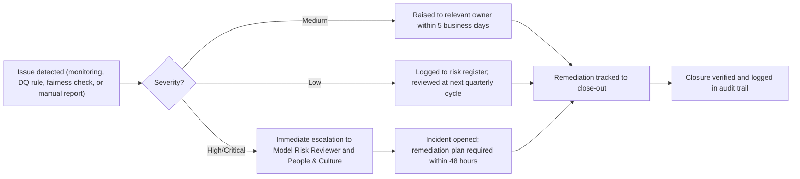

# Risk Register

| ID | Risk | Category | Likelihood | Impact | Owner | Mitigation / control | Status |
|---|---|---|---|---|---|---|---|
| R-01 | Demand forecast under/over-predicts during atypical weeks (public holidays, extreme weather) | Model | Medium | Medium | Workforce Planning | Seasonal-naive baseline retained as a floor comparison; scenario planner allows manual override of demand growth assumption | Monitored |
| R-02 | Scheduling optimiser assigns work in a way that concentrates overtime on a subset of staff | Fairness | Medium | High | People & Culture | Workload-balance term in greedy heuristic; Gini coefficient tracked per run; fairness_checks.py flags cohort gaps | Monitored |
| R-03 | Complexity-tier model underperforms because request-level features carry limited signal about a client-level attribute | Model | High | Low | Data Platform | Documented model limitation in model_card.md; roadmap item to add consented client history features under privacy review | Accepted (documented) |
| R-04 | Protected attributes (gender, age band) leak into scheduling decisions via a correlated proxy | Governance | Low | High | Model Risk Reviewer | Protected attributes never joined into feature tables; fairness checks run every pipeline execution | Controlled |
| R-05 | Coordinators override system recommendations without documented justification | Operational | Medium | Medium | Regional Coordinator | override_reason is a required field on manual overrides; override rate and reasons logged to audit trail every run | Monitored |
| R-06 | Data-quality issues (orphan client references, missing complexity scores, expired certifications) propagate into gold marts undetected | Data Quality | Medium | Medium | Data Platform Engineer | 7 automated DQ rules run every pipeline execution; failures block promotion to "healthy" status on the governance dashboard | Controlled |
| R-07 | Small regional cohorts in fairness reporting risk re-identifying an individual employee | Privacy | Low | High | Model Risk Reviewer | Cohorts below 8 employees suppressed at both the gold-mart and governance-check layers | Controlled |
| R-08 | Synthetic data patterns do not fully represent real seasonal or regional variation at production scale | Model | Medium | Low | Data Platform Engineer | Documented in docs/architecture.md "Scaling to production"; production rollout requires a validation cycle against real history before go-live | Accepted (documented) |
| R-09 | Overtime and SLA-breach models drift as regional staffing mix changes over time | Model | Medium | Medium | Model Risk Reviewer | PSI-based feature drift monitoring (python/monitoring/model_monitoring.py); retraining trigger defined in configs/monitoring.yml | Monitored |
| R-10 | Cancellation/no-show prediction is used to under-resource a region pre-emptively, creating a self-fulfilling capacity shortfall | Operational | Low | Medium | Workforce Planning | Predictions feed recommendations only; scheduling changes require regional coordinator approval (human-in-the-loop) | Controlled |

## Escalation workflow

