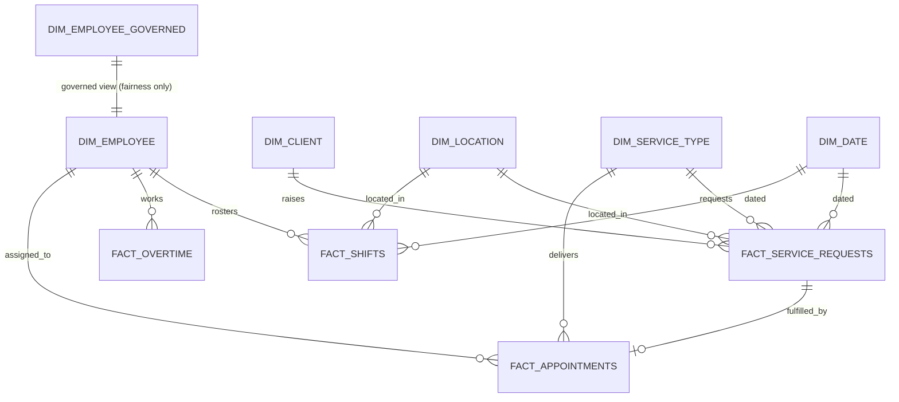

# Semantic Model

## Star schema

## Tables loaded into the Power BI model

Imported from `powerbi/data/*.csv` (exported by `python/utils/export_powerbi.py`):

| Table | Role | Key |
|---|---|---|
| dim_employee | Dimension | employee_id |
| dim_employee_governed | Dimension (fairness-only; not related to fact tables in the model, used only via a standalone fairness query) | employee_id |
| dim_client | Dimension | client_id |
| dim_location | Dimension | location_id |
| dim_service_type | Dimension | service_type_id |
| dim_skill | Dimension | skill_id |
| dim_case_complexity | Dimension | complexity_tier |
| dim_date | Date dimension, marked as the model's official date table | date_key |
| fact_service_requests | Fact | request_id |
| fact_appointments | Fact | appointment_id |
| fact_shifts | Fact | shift_id |
| fact_overtime | Fact | employee_id + week_start_date |
| mart_daily_demand | Pre-aggregated fact (Demand Forecast page) | date_key + location_id + service_type_id + urgency |
| mart_weekly_overtime | Pre-aggregated fact (Capacity/Executive pages) | week_start_date + location_id + primary_role |
| mart_capacity_utilisation | Pre-aggregated fact (Capacity page) | date_key + location_id + primary_role |
| mart_fairness_workload | Pre-aggregated fact (Fairness page, small cohorts suppressed) | gender + age_band + primary_role + location_id |
| mart_service_outcomes | Pre-aggregated fact (Outcomes page) | location_id + service_type_id + month_start_date |
| mart_data_quality | Control fact (Governance page) | dataset + rule |
| demand_forecast_30d | Model output (Demand Forecast page) | date_key + location_id |
| shift_recommendations | Model output (Scheduling page) | location_id |
| scheduling_optimiser_assignments | Model output (Scheduling page) | request_id |
| skill_match_recommendations | Model output (Scheduling page) | request_id + rank |
| scenario_planning | Model output (Executive/Demand pages) | scenario |
| data_quality_report | Control output (Governance page) | rule_id |

## Relationships

- All fact tables relate to `dim_date` on their respective date column (single-directional,
  `dim_date` is the "one" side).
- `fact_service_requests` relates to `dim_client`, `dim_location`, `dim_service_type` (many-to-one).
- `fact_appointments` relates to `dim_employee`, `dim_location`, `dim_service_type`, and to
  `fact_service_requests` via `request_id` (one-to-one/one-to-many depending on cardinality after
  the ~6% backlog exclusion).
- `fact_shifts` and `fact_overtime` relate to `dim_employee` and `dim_location`.
- `dim_employee_governed` is intentionally **not** related to any fact table used by
  operational/scheduling visuals -- it is queried only by the Workforce Fairness page's dedicated
  visuals, consistent with the protected-attribute exclusion principle in
  `governance/privacy_assessment.md`.

## Model-level settings

- **Date table**: `dim_date`, marked as a date table on `date_key`.
- **Row-level security**: a `RegionScope` role filters `fact_service_requests`, `fact_appointments`
  and `fact_shifts` to `location_id = USERPRINCIPALNAME_REGION()` for the Regional Coordinator
  persona, mirroring `configs/access_control.yml`'s `row_level_filter`.
- **Sensitivity labels**: `dim_client` and `fact_appointments` are labelled "Restricted"; all other
  tables "Internal", consistent with `governance/data_catalogue.md`.
